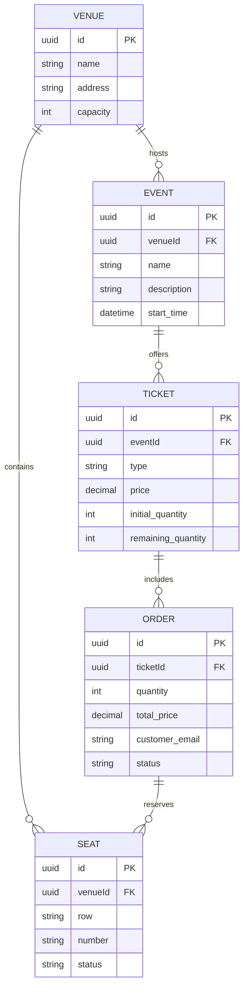

## 1. Project Overview
Design and build a scalable backend for a ticketing system using NestJS, TypeScript, and PostgreSQL. The focus is on a robust API, architectural integrity, and professional-grade implementation.

## 2. Tech Stack & Tools
- **Language:** TypeScript (Node.js 22+)
- **Framework:** NestJS
- **ORM:** Prisma
- **Database:** PostgreSQL
- **API Spec:** OpenAPI 3.0 (via @nestjs/swagger)
- **Containerization:** Docker & Docker Compose
- **Testing:** Jest (Unit & Integration)
- **Deployment:** Google Cloud (Cloud Run / App Engine)

## 3. Database Schema (Entities)

## 4. Phase-wise Task List

### Phase 1: Foundation & Setup
- [ ] Initialize NestJS project with TypeScript.
- [ ] Configure Docker & Docker Compose (PostgreSQL container).
- [ ] Setup Prisma ORM and initial migration.
- [ ] Integrate Swagger for OpenAPI 3.0 documentation.
- [ ] Create `PROMPT_BUILD.md` to track AI usage.

### Phase 2: Core Entities (CRUD)
- [ ] **Venue Module:** Create, Read, Update, Delete venues.
- [ ] **Event Module:** Create, Read, Update, Delete events (linked to Venues).
- [ ] **Ticket Module:** Define ticket types and prices for specific events.
- [ ] Implement global validation pipes and exception filters.

### Phase 3: Order Processing
- [ ] **Order Module:** Implement ticket purchase flow.
- [ ] Add atomicity to ticket quantity updates (handling concurrency).
- [ ] Implement basic order status management (Pending -> Completed).

### Phase 4: Bonus - Reserved Seating (Backend Focus)
- [ ] **Seat Module:** CRUD for venue seats.
- [ ] Implement seat availability lookup for a specific event.
- [ ] Link seats to orders for reserved seating events.

### Phase 5: Testing & QA
- [ ] Write Unit Tests for all services (100% logic coverage).
- [ ] Write Integration Tests for API endpoints.

### Phase 6: Deployment & Documentation
- [ ] Configure production Dockerfile.
- [ ] Setup Google Cloud deployment.
- [ ] Finalize README.md with setup, run instructions, and example cURL requests.
- [ ] (Optional/Decide Later) Build Next.js frontend.

---
## 5. Next Steps
1. **Approval:** Wait for USER approval of this plan.
2. **Execution:** Start Phase 1 (Project Initialization).
